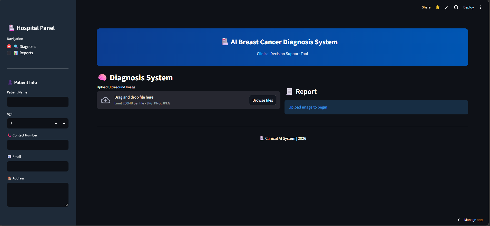
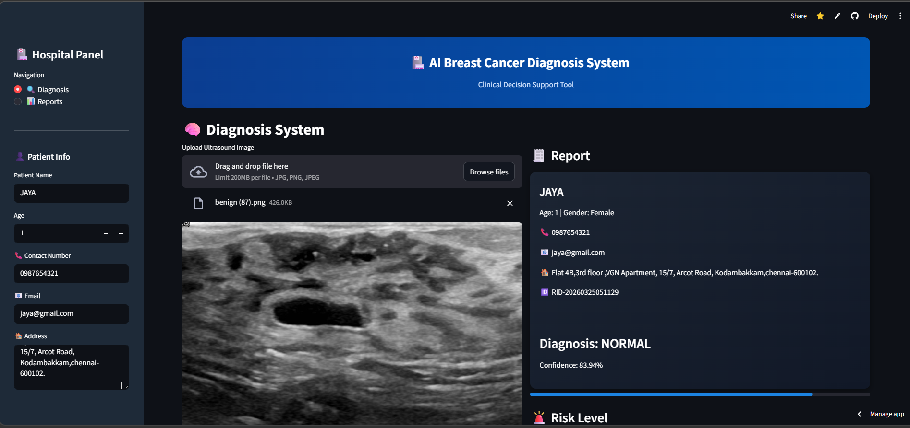
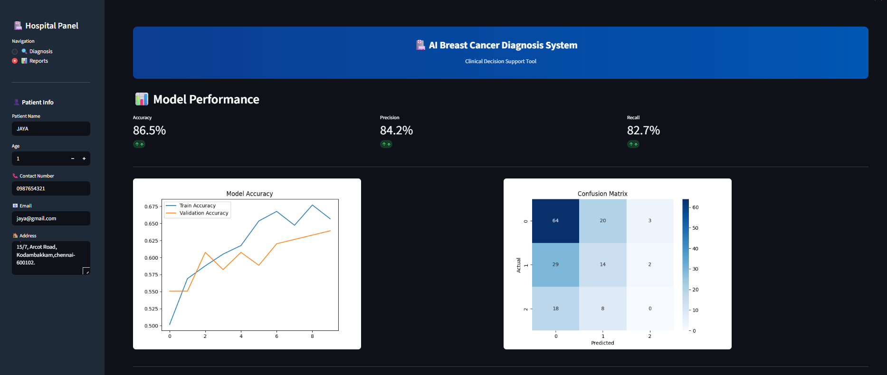

# 🧠 Breast Cancer Detection using Deep Learning (CNN)

## 📌 Overview
This project is an AI-powered system that detects breast cancer using Convolutional Neural Networks (CNN).  
It classifies ultrasound images into **Benign, Malignant, or Normal** categories.

---

## 🚀 Features
- 🧠 Deep Learning-based image classification
- 📷 Upload ultrasound images
- 📊 Confidence score & risk level display
- 📈 Visualization of predictions
- 📄 PDF report generation
- 🌐 Streamlit web application

---

## 🛠️ Technologies Used
- Python  
- TensorFlow / Keras  
- NumPy, Scikit-learn  
- Matplotlib  
- Pillow  
- Streamlit  

---

## 🏗️ Workflow
1. Upload image  
2. Preprocess image  
3. CNN model predicts  
4. Display result with confidence  
5. Generate report  

---

## 📊 Model Details
- Architecture: CNN  
- Optimizer: Adam  
- Loss Function: Categorical Crossentropy  

---

## 📸 Screenshots

### 🔹 Home Page


### 🔹 Prediction Result


### 🔹 Report Output


---

## ⚙️ Installation

```bash
git clone https://github.com/joselinmercy/your-repo-name.git
cd your-repo-name
pip install -r requirements.txt
streamlit run app.py
